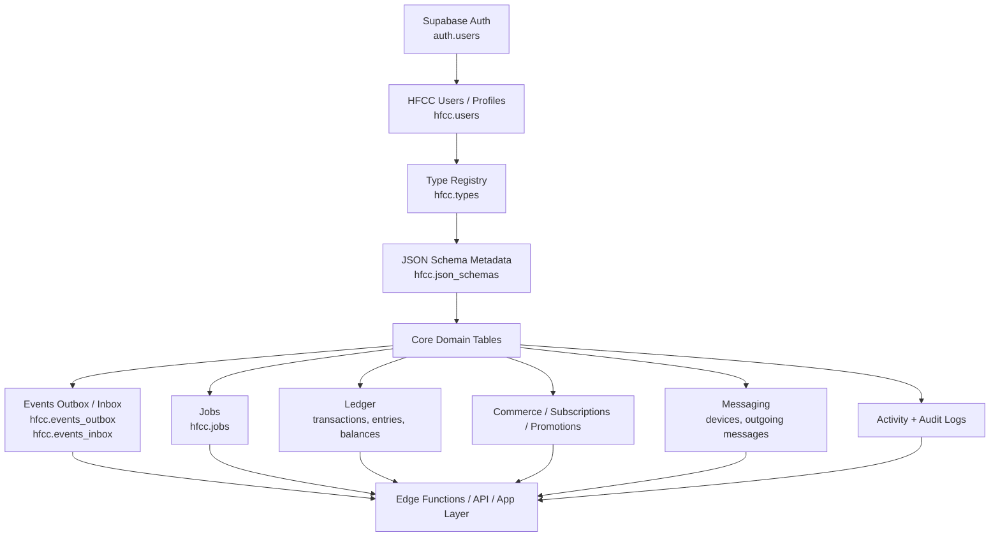
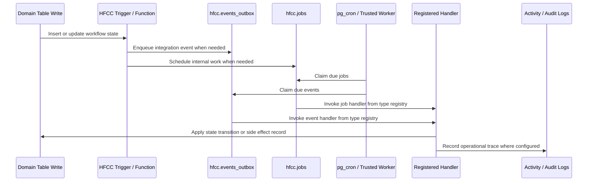
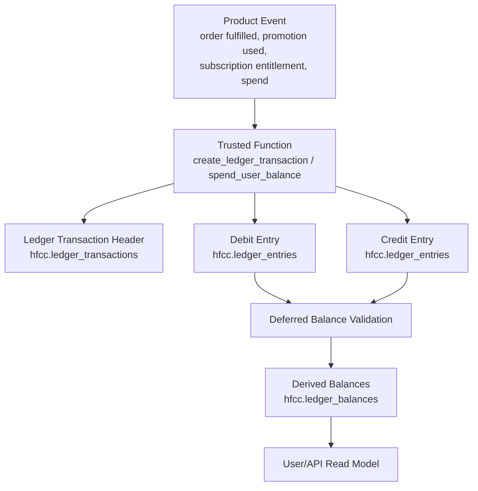
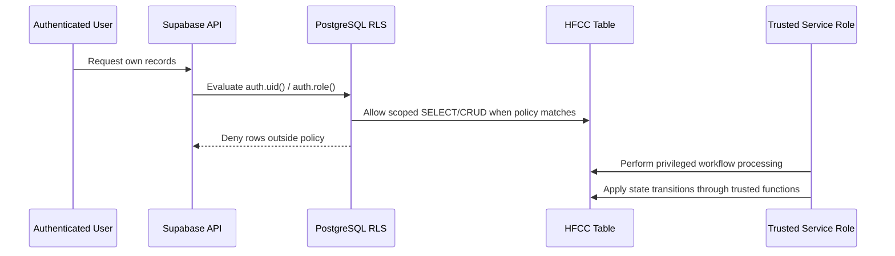

# HFCC Architecture

HFCC is a PostgreSQL/Supabase core for event-driven product systems. It
models identity-linked users, type-driven domain behavior, RLS-aware
access, durable async work, ledger movement, commerce/subscription
workflows, messaging, activity logs, and audit logs inside the database
layer.

This document explains the high-level architecture and the main flows
represented in [HFCC.sql](../HFCC.sql).

## High-Level System Architecture

### Layers

| Layer | Role |
|---|---|
| Supabase Auth | Identity source through `auth.users`, `auth.uid()`, and `auth.role()`. |
| HFCC users/profiles | Application-level user rows and profile metadata. |
| Type registry | Namespaced domain codes, labels, metadata, and optional handler registration. |
| JSON schema metadata | Validation metadata for structured JSONB attributes, payloads, rules, and entitlements. |
| Core domain tables | Product-system state: settings, media, events, jobs, ledger, subscriptions, promotions, commerce, messaging, logs. |
| Runtime tables | Durable outbox/inbox events and jobs for async processing and scheduled workflow state changes. |
| App/API layer | Trusted services, Supabase Edge Functions, or application APIs that call into the database and enforce workflow boundaries. |

## Main Data Flow

1. A Supabase Auth user exists in `auth.users`.
2. HFCC creates or ensures a matching `hfcc.users` row.
3. Domain writes use type codes registered in `hfcc.types`.
4. JSONB fields can be checked against metadata in `hfcc.json_schemas`.
5. Domain tables record orders, subscriptions, promotions, ledger entries, messages, and logs.
6. Triggers and functions enqueue jobs/events or write audit/activity records where appropriate.
7. Trusted workers, `pg_cron`, Edge Functions, or application APIs process due work.

## Event / Outbox / Job Flow

HFCC uses `hfcc.jobs` for internal scheduled work, `hfcc.events_outbox`
for domain events and deferred side effects, and `hfcc.events_inbox` for
externally received events. Processing functions claim due rows and
invoke handler functions registered through `hfcc.types`.

## Ledger Transaction Flow

Ledger movement is modeled with transactions and entries. Entries use
positive amounts plus debit/credit direction codes. Balances are derived
from entries instead of being stored as mutable wallet balance rows.

This demonstrates ledger modeling principles for product systems. It is
not a regulated financial ledger or compliance-certified accounting
implementation.

## RLS / User Access Flow

RLS is enabled on HFCC tables. Authenticated users are scoped to their
own rows where browser-facing access is appropriate. Service-role access
is reserved for trusted processing, administrative workflows, and
privileged state transitions.

## Security Boundary

- Browser-facing access should use authenticated Supabase roles and RLS policies.
- Privileged workflows should run through trusted server code, Supabase Edge Functions, or service-role workers.
- Raw card data, provider secrets, service-role keys, and private credentials should not be stored in HFCC tables.
- RLS policies, grants, and `SECURITY DEFINER` functions should be reviewed before any production adaptation.

## Operational Notes

- `pg_cron` is used when available for due job/event processing.
- Environments without `pg_cron` can process `hfcc.jobs` and `hfcc.events_outbox` from a trusted external worker.
- Audit logs and activity logs are designed for traceability, not as a substitute for a full observability stack.
- [HFCC.md](../HFCC.md) remains the detailed schema and function reference.
